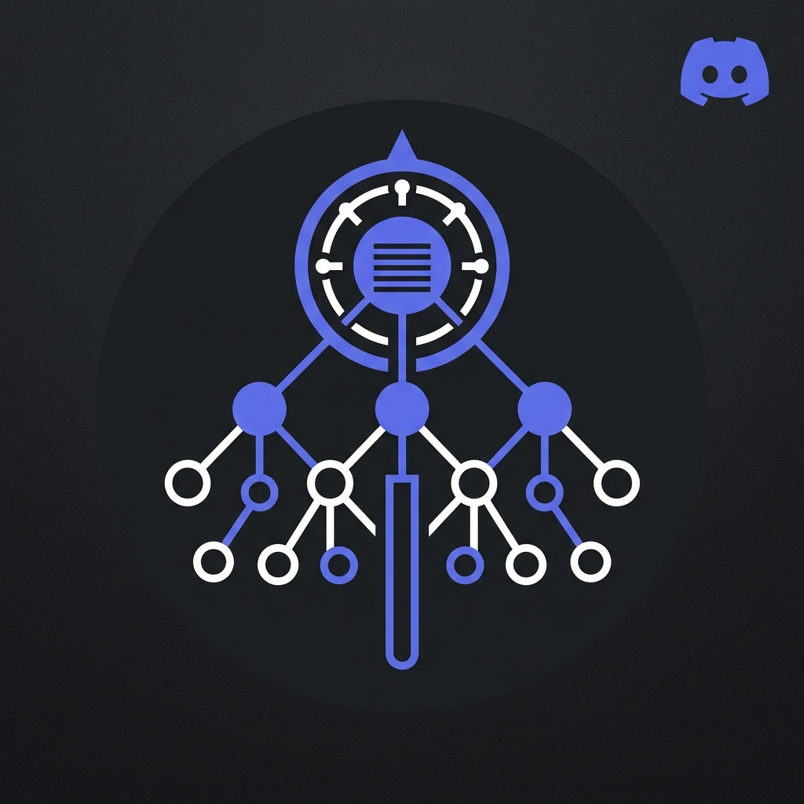

<p align="center">
  
</p>

<h1 align="center">MapMyServer</h1>

<p align="center">
  <strong>Discord Server Blueprint Analyzer</strong><br/>
  A Chrome Extension + Backend that maps, analyzes, and visualizes the full architecture of Discord communities.
</p>

<p align="center">
  
  
  
  
  
</p>

---

## What Is This?

**MapMyServer** turns any Discord server into a structured, analyzable blueprint. Instead of manually browsing through dozens of categories and channels, you get:

- A **collapsible tree** of the entire server hierarchy with category sub-divisions
- A **node graph** (React Flow) showing how categories and channels connect
- **🤖 One-Click AI Optimizer Export**: Generate ready-to-paste prompts for ChatGPT, Claude, or Gemini to audit your community architecture, suggest missing channels, and build a complete role & permission hierarchy
- **⚡ Live Auto-Reload & Server Tracking**: Automatically tracks Discord sidebar edits in real-time and switches blueprints as you navigate between servers
- **🌀 Virtualized Scroller Scanner**: Sweeps large Discord servers with 50+ categories to capture all off-screen channels
- **Channel purpose classification** (Onboarding, Governance, Support, Events, etc.)
- **Rich channel detail cards** with topics, instructions, templates, and rules
- **Source tracking & Provenance** — every piece of extracted data knows exactly where it came from
- **Statistics dashboard** with content coverage, purpose distribution, and structural metrics

---

## ⚖️ Two Ways to Use MapMyServer: Browser Mode vs. Developer Mode

You choose how deep you want to go. For standard structure mapping, **no developer portal or coding is required**.

| Feature | 🌐 Mode 1: Browser Mode (DOM / Inspect)<br/>**Default · Zero Setup** | 🔑 Mode 2: Developer Mode (OAuth2 / Bot)<br/>**Optional · Deep Analysis** |
|---|---|---|
| **Who is it for?** | **Everyone / Non-coders** | Community Architects, Admins & Developers |
| **Setup Required** | **None.** Just load the extension and open Discord. | Paste Bot Token or OAuth credentials directly in Extension Settings ⚙️. |
| **Do I need to edit code?** | ❌ No | ❌ No (configured directly in the UI). |
| **Server Tree & Categories** | ✅ **Yes** — extracted directly from sidebar. | ✅ **Yes** — fetched via official Discord API. |
| **Large Server Support** | ✅ **Yes** — automated virtual scroller sweep. | ✅ **Complete** — all channels fetched in 1 request. |
| **Live Auto-Reload** | ✅ **Yes** — tracks name changes & server switching. | ✅ **Yes** — fetches fresh data on demand. |
| **AI Prompt Export** | ✅ **Yes** — 1-click export for ChatGPT/Claude/Gemini. | ✅ **Yes** — with complete role & permission matrix. |
| **Channel Topics & Welcome Text** | ✅ **Yes** — reads what is visible on screen. | ✅ **Yes** — read from Discord channel objects. |
| **Server Rules & Templates** | ✅ **Yes** — reads from `#rules` or `#welcome`. | ✅ **Yes** — read from channel history / system channels. |
| **Visible Roles** | ⚠️ Partial (roles visible on member cards). | ✅ **Complete** — all server roles, colors, and order. |
| **Exact Permission Matrix** | ⚠️ Basic (what your account can see). | ✅ **Exact Bitfield Permissions** — full allow/deny rules per role. |
| **Need Discord Open in Tab?** | Yes, you must have Discord open in a browser tab. | No, can fetch data headlessly in the background. |

---

## 🚀 Option A: Quick Setup for Non-Coders (Browser Mode — No Coding)

You do **not** need to touch any terminal, write code, or create a Discord Bot.

### Step 1: Open Chrome Extensions
1. Open Google Chrome.
2. In the address bar, type `chrome://extensions` and press **Enter**.  
   *(Or click the 3 vertical dots at the top right of Chrome ➔ **Extensions** ➔ **Manage Extensions**).*

### Step 2: Turn on Developer Mode
Look at the **top-right corner** of the Extensions page and toggle the switch labeled **Developer mode** to **ON**.

```
                           [ Developer mode  (●) ON ]
```

### Step 3: Click "Load unpacked"
Click the button labeled **Load unpacked** in the top-left corner.

```
[ Load unpacked ]  [ Pack extension ]  [ Update ]
```

### Step 4: Select the `extension/dist` Folder
A file browser window will pop up:
1. Navigate to the downloaded `MapMyServer` project folder.
2. Open the **`extension`** folder.
3. Select the **`dist`** folder and click **Select Folder**:
   ```
   MapMyServer /
   └── extension /
       └── dist  <-- 🎯 SELECT THIS FOLDER
   ```

> 💡 **Why `extension/dist`?**  
> Chrome requires a file named `manifest.json` to recognize and run the extension. The ready-to-run compiled files and `manifest.json` are inside `extension/dist`.

---

### Step 5: Start Mapping Discord!
1. Pin **MapMyServer** to your Chrome toolbar (click the puzzle icon 🧩 in the top-right corner of Chrome, then click the pin 📌 next to MapMyServer).
2. Open Discord in your browser: [https://discord.com/channels/@me](https://discord.com/channels/@me) and navigate to any server you want to analyze.
3. Click the **MapMyServer icon** in your toolbar and click **Open Dashboard** (or open the Chrome Side Panel).
4. Click **"🔍 Analyze Current Server"**!
5. *Want a demo?* You can explore all features anytime by clicking **"🧪 Load Rich Mock Community"**.

---

## 🔑 Option B: Developer Mode (OAuth2 / Bot API — Direct UI Configuration)

If you want **deep permission auditing** (full role hierarchies and exact allow/deny matrices) on servers you own or manage:

1. Open the MapMyServer Side Panel.
2. Click the **⚙️ Settings icon** in the top-right header.
3. Enter your credentials directly into the UI:
   - **Backend API Endpoint:** `http://localhost:3000` (or your deployed backend URL)
   - **Discord Session / JWT Token:** Paste your authenticated token
   - **Custom Bot Token:** Paste your Discord Bot Token (`Bot OTU4...`)
4. Click **💾 Save Settings**.
5. All credentials are saved directly in your browser's private extension storage — **zero code editing required**.

---

## Security Boundary

> **This extension only collects data the current user/application is authorized to access.**

- ✅ Reads page-visible DOM elements on `discord.com`
- ✅ Uses official Discord OAuth2 API for authorized data collection
- ✅ Tags all data with provenance metadata (`page-visible`, `discord-api`, etc.)
- ❌ Does **NOT** extract authentication tokens or cookies
- ❌ Does **NOT** use self-bot patterns or unauthorized API calls
- ❌ Does **NOT** intercept network requests or scrape member lists

---

## Features by Phase

### ✅ Phase 1 — Chrome Extension & Rich Data Model

| Feature | Status |
|---|---|
| Chrome Extension (Manifest V3, Side Panel, Popup) | ✅ |
| React 19 + TypeScript + Vite + CRXJS | ✅ |
| Discord-themed Tailwind CSS design system | ✅ |
| `ServerBlueprint` data model with full type safety | ✅ |
| Categories, Channels (text/voice/stage/forum/announcement/media) | ✅ |
| Threads with `messageCount`, `locked`, `autoArchiveDuration` | ✅ |
| Roles with `managed`, `mentionable`, `hoist`, `permissions` | ✅ |
| **Channel Purpose Classification** (12-purpose taxonomy) | ✅ |
| **Source Tracking** (`ExtractedContent` with full provenance) | ✅ |
| **Structured Channel Content** (instructions, templates, rules, pinned messages) | ✅ |
| **Server Rules** as a first-class feature | ✅ |
| Interactive Tree View with purpose badges & content indicators | ✅ |
| **Channel Detail Slide-Over Panel** with provenance inspector | ✅ |
| Statistics Dashboard (type distribution, purpose coverage, content metrics) | ✅ |
| Change History & Snapshot management | ✅ |
| Rich Mock Data (GDG Community model with templates, rules, instructions) | ✅ |
| DOM-based server detection & structure parsing | ✅ |

### ✅ Phase 2 — Graph UI, Backend & In-UI Settings

| Feature | Status |
|---|---|
| **Monorepo** (NPM workspaces: `extension`, `backend`, `shared`) | ✅ |
| **Shared Types** (`@mapmyserver/shared` package) | ✅ |
| **React Flow Graph UI** (Dagre auto-layout, interactive pan/zoom) | ✅ |
| **Node.js/Express Backend** with TypeScript | ✅ |
| **Discord OAuth2** (`/api/auth/login`, `/api/auth/callback`) | ✅ |
| **In-UI Settings Panel** (save Bot tokens & endpoints without editing code) | ✅ |
| **JWT Session Management** | ✅ |
| **Discord API Client** (Guilds, Channels, Roles) | ✅ |
| **Normalizer** (Discord API → `ServerBlueprint` with purpose heuristics) | ✅ |
| **Server List UI** (Login with Discord → select authorized servers) | ✅ |
| Backend `/api/servers` and `/api/servers/:id/blueprint` endpoints | ✅ |

### 🔲 Phase 3 — Search, Filters, Snapshots & Change Detection

| Feature | Status |
|---|---|
| Advanced search (by purpose, content, topic) | 🔲 |
| Export (JSON / CSV / PNG) | 🔲 |
| Snapshot diffing & change detection | 🔲 |
| Server comparison (side-by-side) | 🔲 |

### 🔲 Phase 4 — AI-Powered Analysis

| Feature | Status |
|---|---|
| AI-assisted channel purpose classification | 🔲 |
| Server architecture analysis & recommendations | 🔲 |
| Professional community pattern detection | 🔲 |
| Blueprint recommendations for server optimization | 🔲 |

---

## Tech Stack

| Layer | Technology |
|---|---|
| **Extension** | React 19, TypeScript, Vite, CRXJS, Tailwind CSS v3, Zustand v5 |
| **Graph UI** | @xyflow/react, dagre (auto-layout) |
| **Backend** | Node.js, Express, Axios, JWT, dotenv |
| **Shared Types** | Pure TypeScript package (`@mapmyserver/shared`) |
| **Browser** | Chrome Manifest V3, Side Panel API, chrome.storage.local |

---

## Project Structure

```
MapMyServer/
├── extension/                     # Chrome Extension (React + Vite)
│   ├── manifest.json              # Chrome Manifest V3
│   ├── sidepanel.html             # Side Panel entry
│   ├── popup.html                 # Popup entry
│   ├── public/icons/              # Extension icons
│   └── src/
│       ├── background/            # Service worker
│       ├── content/               # Discord page observer
│       │   └── parsers/           # DOM parsers
│       ├── services/              # Blueprint builder, statistics, mock data
│       ├── store/                 # Zustand state (server + UI)
│       ├── types/                 # Message types
│       ├── styles/                # Tailwind + global CSS
│       ├── sidepanel/
│       │   └── components/        # All dashboard components
│       │       ├── ServerOverview  # Overview + server rules card
│       │       ├── ServerTree      # Collapsible tree with purpose badges
│       │       ├── ServerGraph     # React Flow node graph
│       │       ├── ChannelDetail   # Slide-over with provenance inspector
│       │       ├── SettingsModal   # In-UI API & Token configuration
│       │       ├── Statistics      # Charts & metrics
│       │       ├── ChangeHistory   # Snapshots & diffs
│       │       ├── ServerList      # Authorized servers (OAuth2)
│       │       └── ...
│       └── popup/                 # Quick overview popup
│
├── backend/                       # Node.js Express API
│   └── src/
│       ├── auth/discord.ts        # OAuth2 login & callback
│       ├── services/
│       │   ├── discordApi.ts      # Discord API client
│       │   └── normalizer.ts      # Discord → ServerBlueprint
│       ├── routes/api.ts          # /api/servers endpoints
│       └── server.ts              # Express entry point
│
├── shared/                        # Shared TypeScript types
│   └── src/index.ts               # ServerBlueprint, Channel, ExtractedContent, etc.
│
├── logo.jpg                       # Project logo
└── package.json                   # NPM workspaces root
```

---

## 🛠️ Developer Setup & Building from Source

If you are contributing or modifying the source code:

### Prerequisites
- Node.js 18+
- npm 9+

### 1. Install Dependencies
```bash
npm install
```

### 2. Build All Workspaces
```bash
npm run build --workspaces
```

### 3. (Optional) Run Local Backend
```bash
cd backend
npm run dev
```

---

## Data Model Overview

The core `ServerBlueprint` schema captures the full architecture of a Discord community:

```
ServerBlueprint
├── server          → Name, description, features, boost level, member count
├── categories[]    → Ordered category list with channel IDs
├── channels[]      → Name, type, topic, description, content, purpose, permissions
│   ├── content     → welcomeMessage, instructions[], rules[], template, pinnedMessages[]
│   └── purpose     → ONBOARDING | GOVERNANCE | COMMUNITY | SUPPORT | ... (12 types)
├── threads[]       → Name, archived, locked, messageCount
├── roles[]         → Name, color, position, managed, hoist, mentionable
├── rules           → First-class server rules with source provenance
├── statistics      → Type counts, purpose distribution, content coverage
├── collectedAt     → Timestamp
└── version         → Schema version (currently 2)
```

Every piece of extracted content includes full **source tracking**:

```typescript
interface ExtractedContent {
  text: string;
  source: {
    type: "channel-topic" | "message" | "pinned-message" | "welcome-message" | ...;
    channelId: string;
    messageId?: string;
    authorName?: string;
    collectedAt: string;
    visibility: { source: "discord-api" | "page-visible"; accessibleToUser: boolean };
  };
}
```

---

## License

MIT
